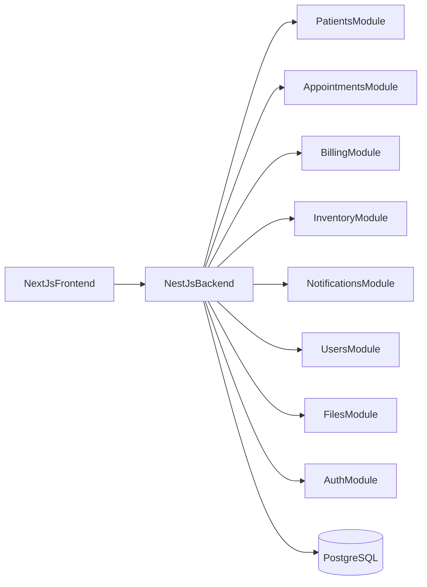
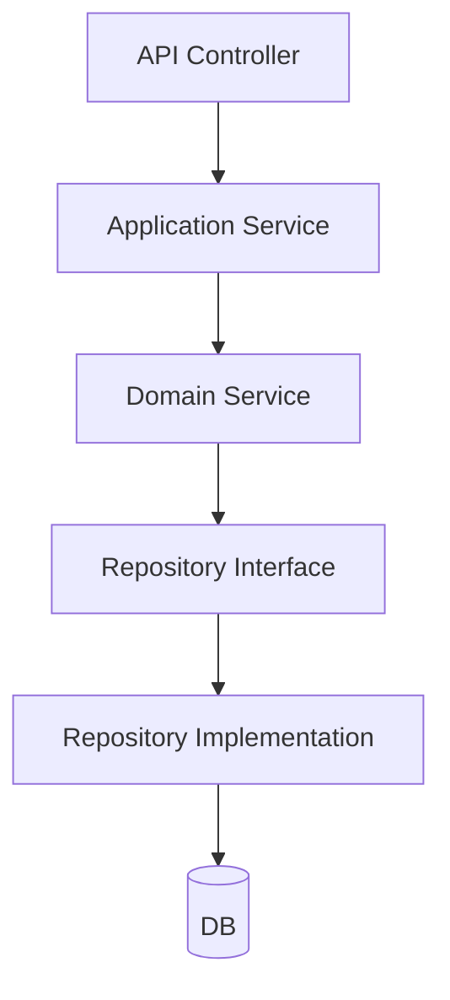

## Genel Mimari Özeti

- **Backend**: `backend` klasörü altında NestJS tabanlı REST API.
- **Frontend**: `frontend` klasörü altında Next.js (React) tabanlı web arayüzü.
- **Veritabanı**: PostgreSQL (ileride Docker-compose ile eklenecek).
- **Modüller**: Patients, Appointments, Billing, Inventory, Notifications, Users, Files, Auth.

### Backend Katmanları (DDD-lite)

Her feature modülü `src/modules/<feature>` altında aşağıdaki katmanlara ayrılır:

- `domain`: Entity tanımları, domain servisleri, repository interface'leri.
- `application`: Use-case servisleri (ör. `CreatePatient`, `ScheduleAppointment`).
- `infra`: ORM repository implementasyonları ve diğer dış bağımlılıklar.
- `api`: NestJS controller'ları, DTO'lar ve HTTP mapping.

### Frontend Yapısı (Next.js)

- Route yapısı:
  - `/login`
  - `/dashboard`
  - `/patients`
  - `/patients/[id]`
  - `/appointments`
  - `/billing`
  - `/inventory`
  - `/settings/users`
  - `/reports`

- Ortak bileşenler:
  - Layout (sidebar + topbar)
  - Tablo ve form bileşenleri
  - Modallar ve toast bildirimi
  - Özel bileşenler: `OdontogramView`, `CalendarView`, `FinanceSummaryCard`

